## Task1: Academic Management System ( using SQL)
Design and develop an Academic Management System using SQL. The projects should involve three tables 1.StudentInfo 2. CoursesInfo 3.EnrollmentInfo. The Aim is to create a system that allows for managing student information and course enrollment.

1. Database Creation:

a) Create the StudentInfo table with columns STU_ ID, STU_NAME, DOB, PHONE_NO, EMAIL_ID,ADDRESS.

b) Create the CoursesInfo table with columns COURSE_ID, COURSE_NAME,COURSE_INSTRUCTOR NAME.

c) Create the EnrollmentInfo with columns ENROLLMENT_ID, STU_ ID, COURSE_ID,ENROLL_STATUS(Enrolled/Not Enrolled). The FOREIGN KEY constraint in the EnrollmentInfo table references the STU_ID column in the StudentInfo table and the COURSE_ID column in the CoursesInfo table.

2. Data Creation:

Insert some sample data for StudentInfo table , CoursesInfo table, EnrollmentInfo with respective fields.

**Output for DB Creation:**

3. Retrieve the Student Information:

a) Write a query to retrieve student details, such as student name, contact informations, and Enrollment status.
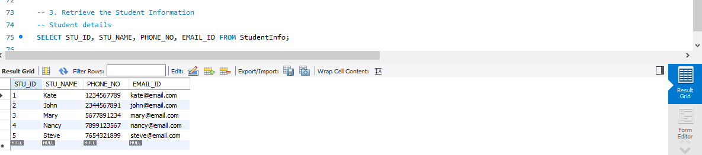
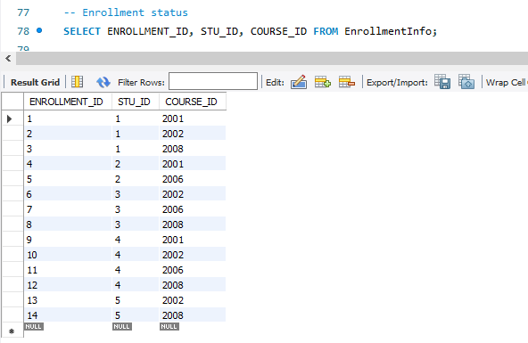

b) Write a query to retrieve a list of courses in which a specific student is enrolled.
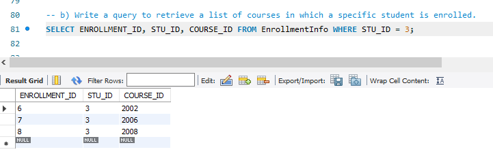

c) Write a query to retrieve course information, including course name, instructor information.
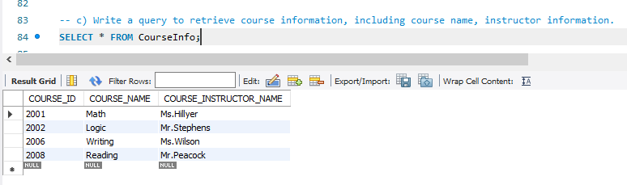

d) Write a query to retrieve course information for a specific course.
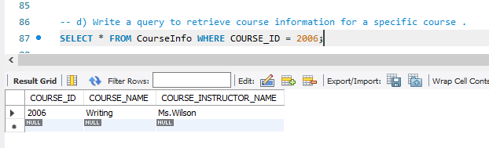

e) Write a query to retrieve course information for multiple courses.
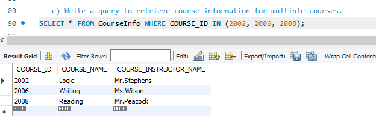

4. Reporting and Analytics (Using joining queries)

a) Write a query to retrieve the number of students enrolled in each course
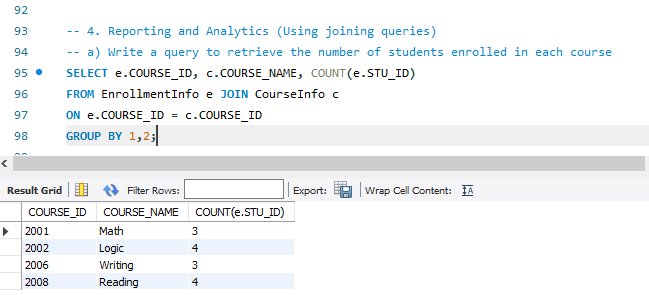

b) Write a query to retrieve the list of students enrolled in a specific course.
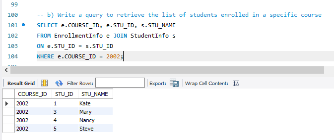

c) Write a query to retrieve the count of enrolled students for each instructor.
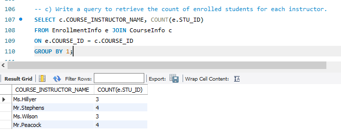

d) Write a query to retrieve the list of students who are enrolled in multiple courses
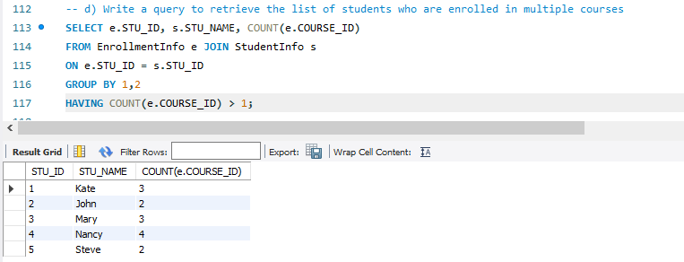

e) Write a query to retrieve the courses that have the highest number of enrolled students(arranging from highest to lowest)
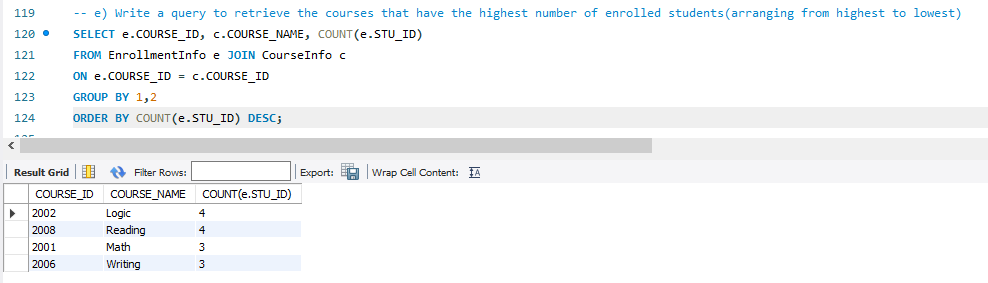
