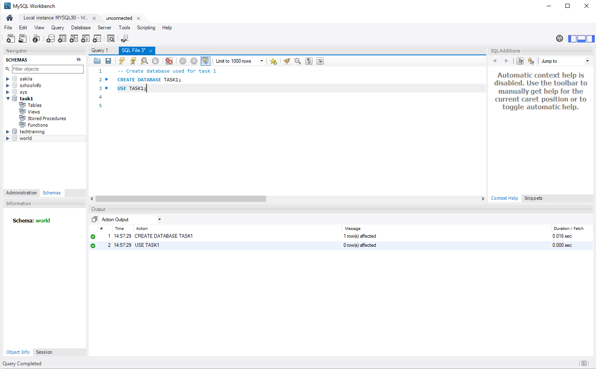
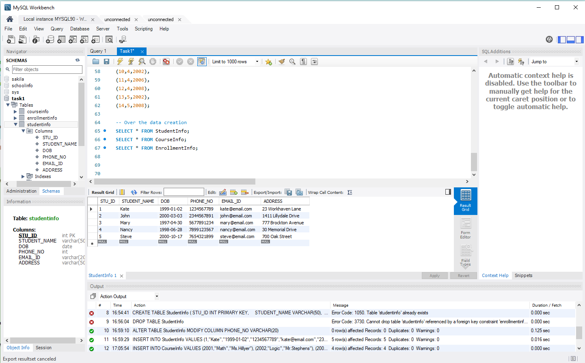
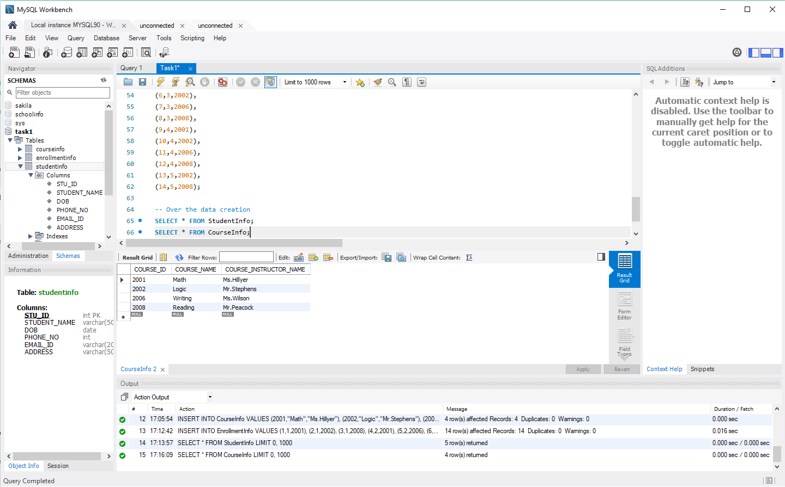
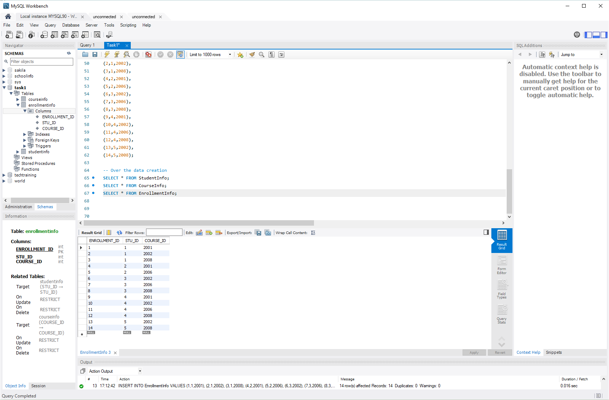

# Task1: Academic Management System ( using SQL)
Design and develop an Academic Management System using SQL. The projects should involve three tables 1.StudentInfo 2. CoursesInfo 3.EnrollmentInfo. The Aim is to create a system that allows for managing student information and course enrollment.

1. Database Creation:

a) Create the StudentInfo table with columns STU_ ID, STU_NAME, DOB, PHONE_NO, EMAIL_ID,ADDRESS.

b) Create the CoursesInfo table with columns COURSE_ID, COURSE_NAME,COURSE_INSTRUCTOR NAME.

c) Create the EnrollmentInfo with columns ENROLLMENT_ID, STU_ ID, COURSE_ID,ENROLL_STATUS(Enrolled/Not Enrolled). The FOREIGN KEY constraint in the EnrollmentInfo table references the STU_ID column in the StudentInfo table and the COURSE_ID column in the CoursesInfo table.

2. Data Creation:
Insert some sample data for StudentInfo table , CoursesInfo table, EnrollmentInfo with respective fields.

**Output for DB Creation:**

