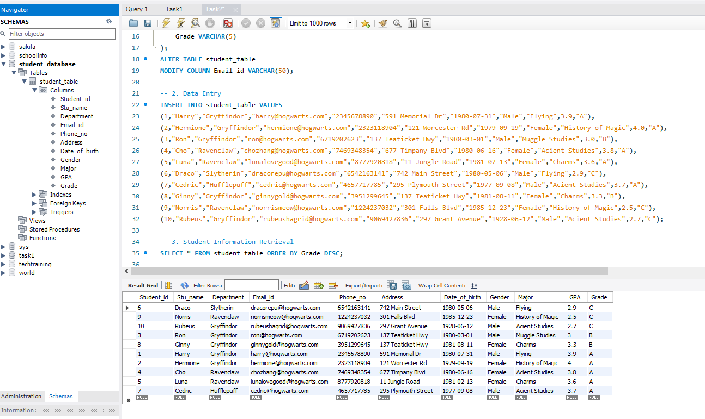
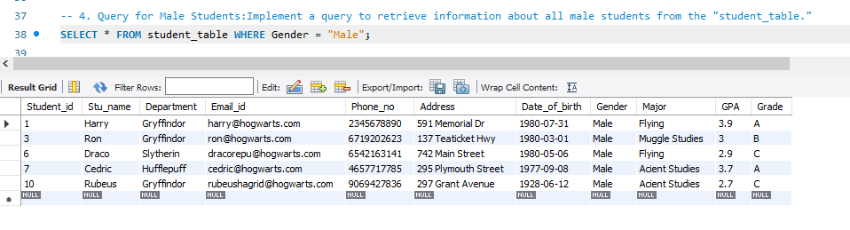
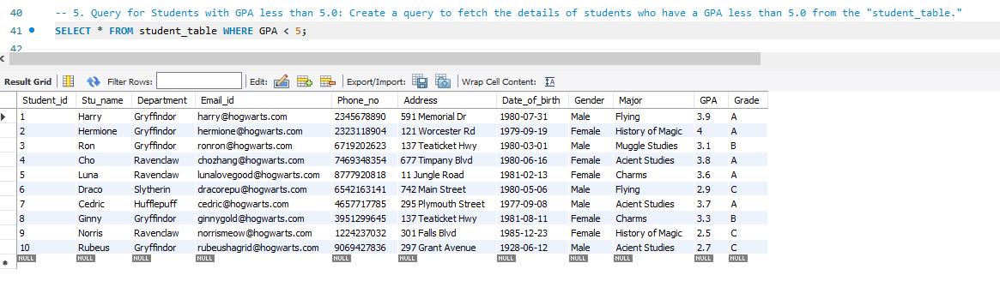
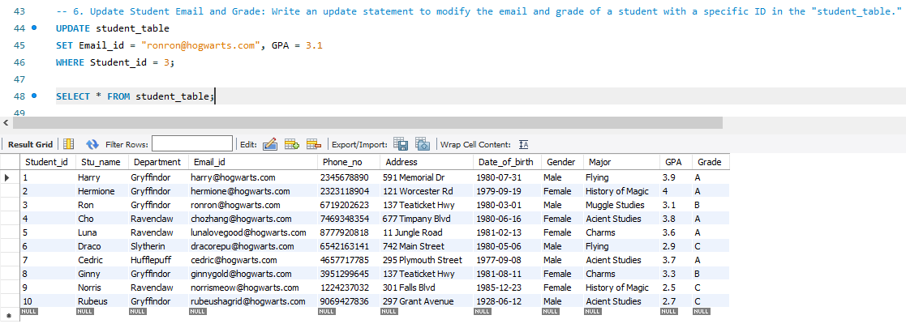
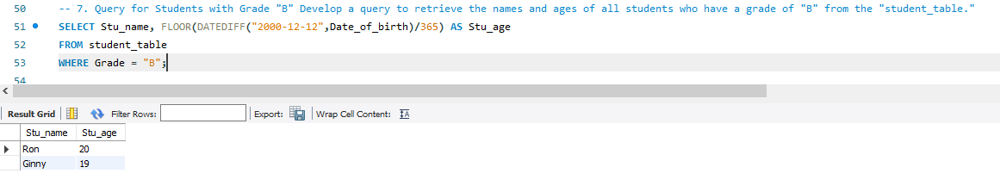
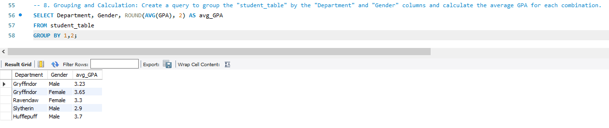
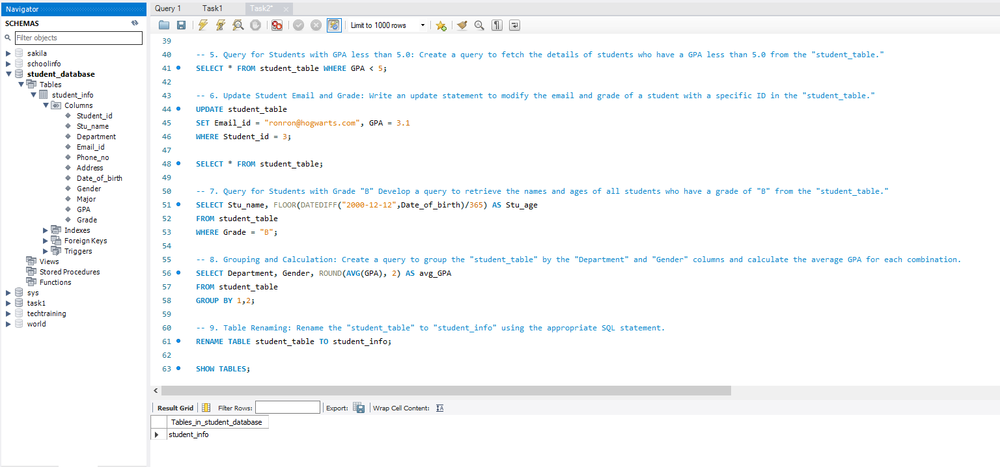
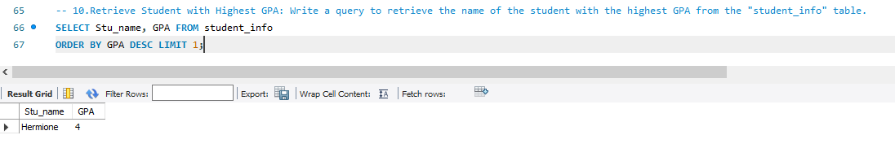

## Task2: Student Database Management System

Objective: Design and implement a student database management system using PostgreSQL that allows storing and retrieving student information efficiently.

1. Database Setup

Create a database named "student_database."

Create a table called " student_table " with the following columns: Student_id (integer), Stu_name (text), Department (text), email_id (text ),Phone_no (numeric), Address (text), Date_of_birth (date), Gender (text), Major (text), GPA (numeric),Grade (text) should be A,B,C etc.

2. Data Entry

Insert 10 sample records into the "student_table" using INSERT command.

3. Student Information Retrieval

Develop a query to retrieve all students' information from the "student_table" and sort them in descending order by their grade.

4. Query for Male Students:
Implement a query to retrieve information about all male students from the "student_table."

5. Query for Students with GPA less than 5.0:
Create a query to fetch the details of students who have a GPA less than 5.0 from the "student_table."

6. Update Student Email and Grade:
Write an update statement to modify the email and grade of a student with a specific ID in the "student_table."

7. Query for Students with Grade "B":
Develop a query to retrieve the names and ages of all students who have a grade of "B" from the "student_table."

8. Grouping and Calculation:
Create a query to group the "student_table" by the "Department" and "Gender" columns and calculate the average GPA for each combination.

9. Table Renaming:
Rename the "student_table" to "student_info" using the appropriate SQL statement.

10. Retrieve Student with Highest GPA:
Write a query to retrieve the name of the student with the highest GPA from the "student_info" table.

