## Task 3: Event Management System using PostgreSQL.

Objective: To develop the application that allows users to create and manage events, track attendees, and handle event registrations efficiently. The project will include the following tasks:

1. Database Creation
Create a database named "EventsManagement." Create tables for Events, Attendees, and Registrations.
Events- Event_Id, Event_Name, Event_Date, Event_Location, Event_Description
Attendees- Attendee_Id, Attendee_Name, Attendee_Phone, Attendee_Email, Attendee_City
Registrations-Registration_id, Event_Id, Attendee_Id,Registration_Date,Registration_Amount.
The FOREIGN KEY constraint in the Registrations table references the Event_Id column in the Events table and the Attendee_Id column in the Attendees table.
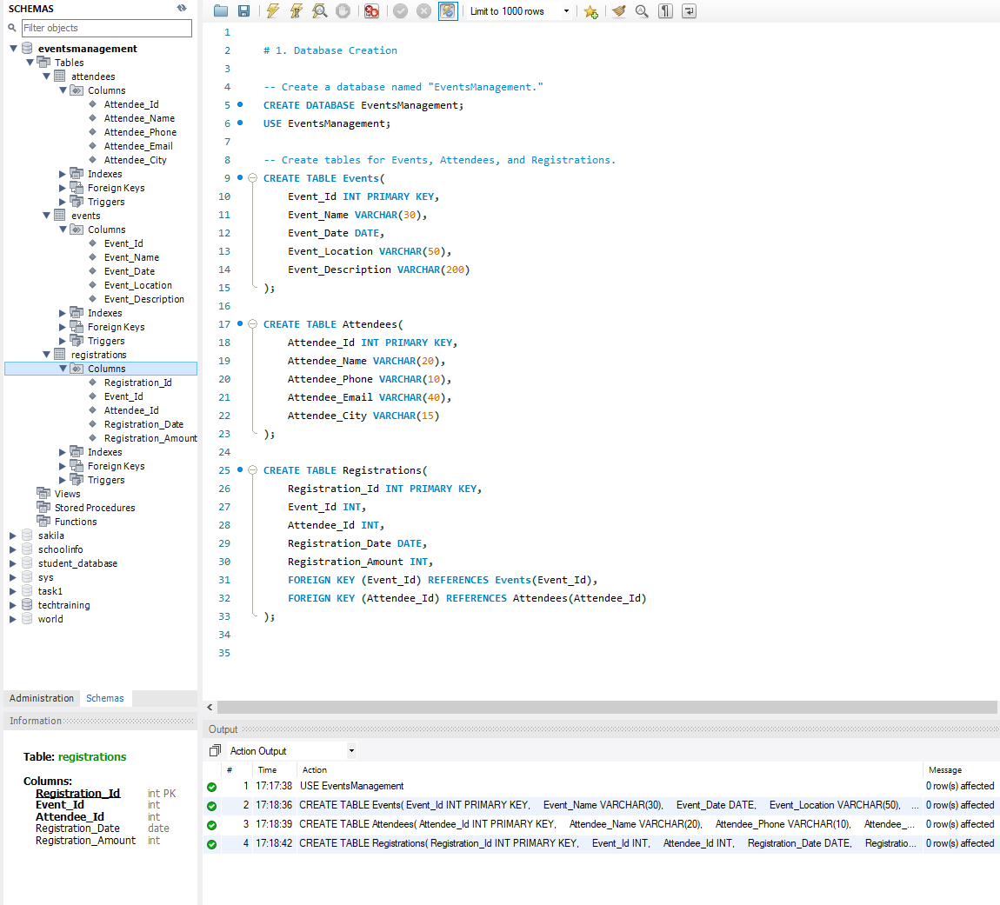

2. Data Creation
Insert some sample data for Events, Attendees, and Registrations tables with respective fields.
- Table Events
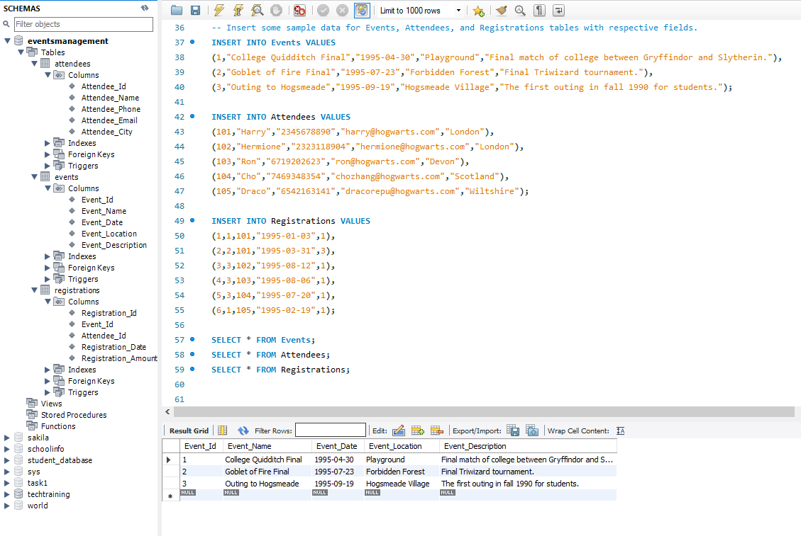

- Table Attedees
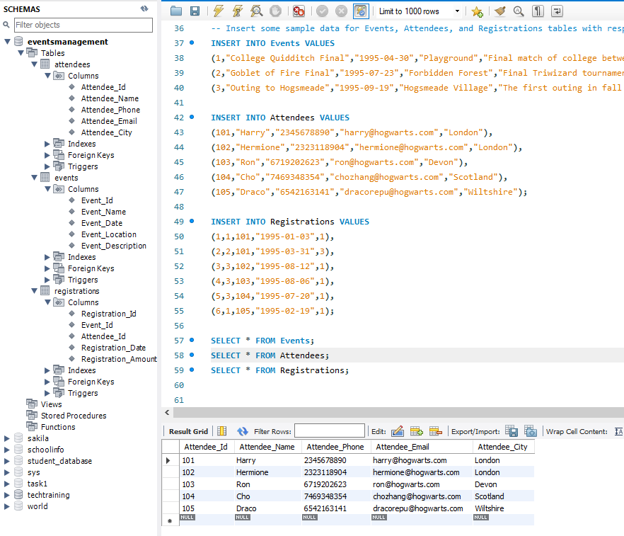

- Table Registrations
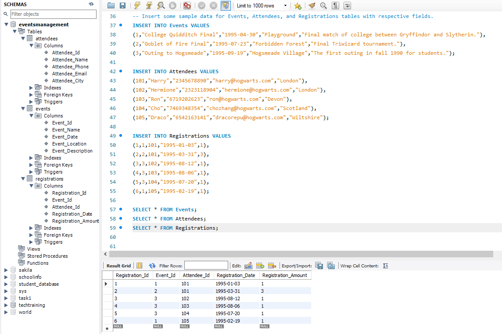

3. Manage Event Details

a) Inserting a new event.
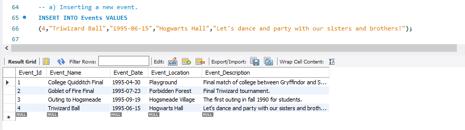

b) Updating an event's information.
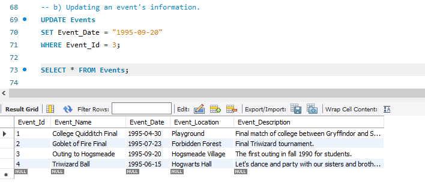

c) Deleting an event.
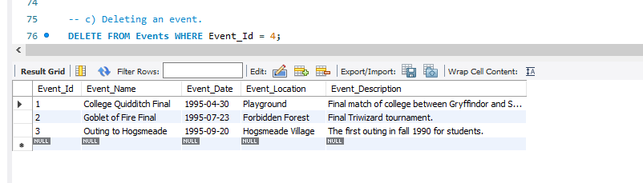

4. Manage Track Attendees & Handle Events

a) Inserting a new attendee.

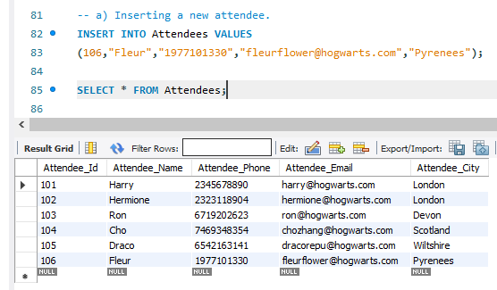

b) Registering an attendee for an event.

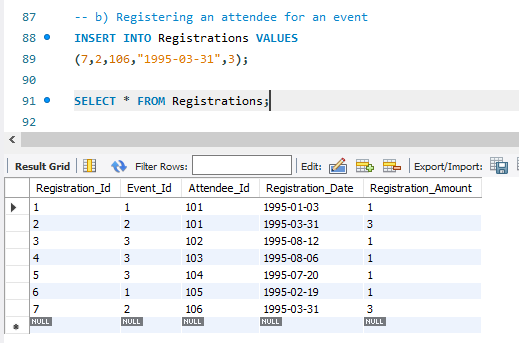

5.Develop queries to retrieve event information, generate attendee lists, and calculate event attendance statistics.

a) Write a query to retrieve the number of attendees registrated and total registration amount in each event
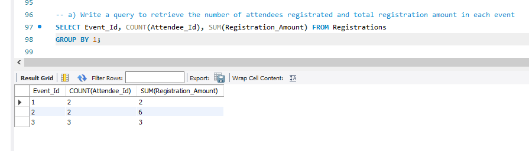

b) Write a query to retrieve the list of attendee names who registrated in event "Outing to Hogsmeade".
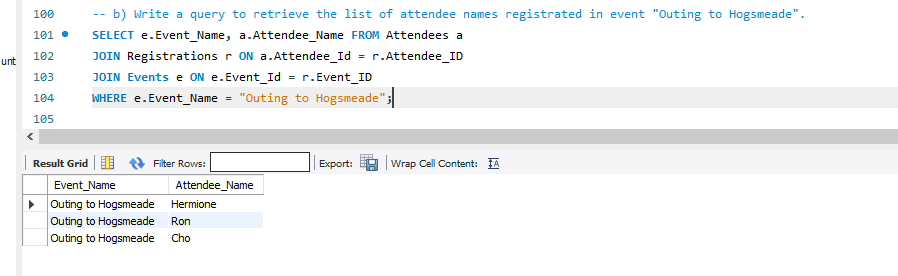

c) Write a query to retrieve the list of attendee names who registrated in multiple envents.
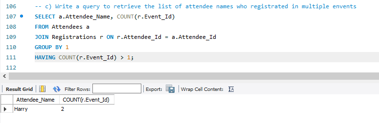

d) Write a query to calculate the total attendees registrated in event by event month and event location(ROLLUP function)
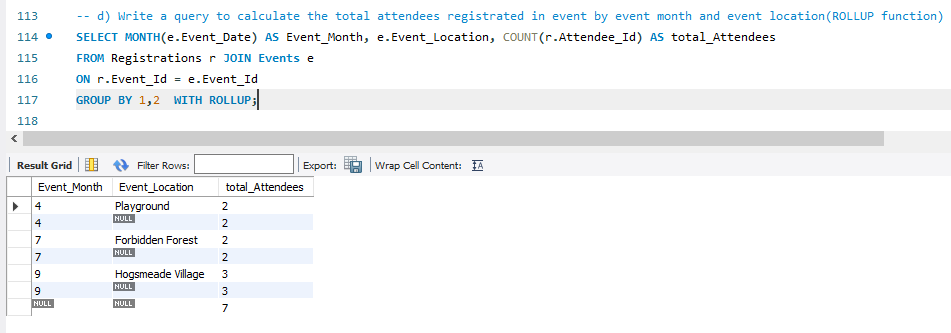
