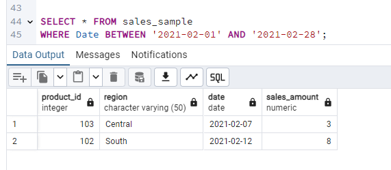

## Task4: OLAP Operations

Objective: Perform OLAP operations (Drill Down, Rollup, Cube, Slice, and Dice) on the "sales_sample" table to analyze sales data. Develop the queries to retrieve information from the OLAP operations performed and to gain a deeper understanding of the sales data through different dimensions, aggregations, and filters.

1. Database Creation

Create a database to store the sales data (Redshift or PostgreSQL). Create a table named "sales_sample" with the specified columns: Product_Id (Integer); Region (varchar(50))-like East ,West etc; Date (Date); Sales_Amount (int/numeric)

2. Data Creation

Insert 10 sample records into the "sales_sample" table, representing sales data.

- Table: sales_samples

3. Perform OLAP operations

a) Drill Down-Analyze sales data at a more detailed level. Write a query to perform drill down from region to product level to understand sales performance.

b) Rollup- To summarize sales data at different levels of granularity. Write a query to perform roll up from product to region level to view total sales by region.

c) Cube - To analyze sales data from multiple dimensions simultaneously. Write a query to Explore sales data from different perspectives, such as product, region, and date.

d) Slice- To extract a subset of data based on specific criteria. Write a query to slice the data to view sales for a particular region or date range.

e) Dice - To extract data based on multiple criteria. Write a query to view sales for specific combinations of product, region, and date

